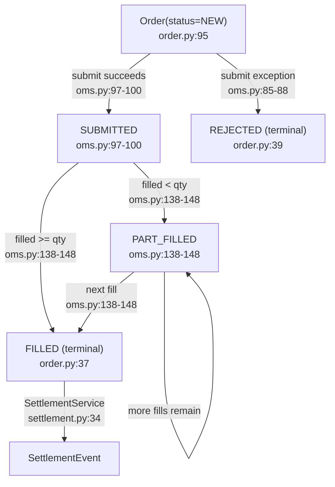
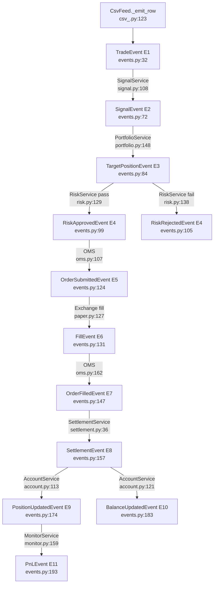
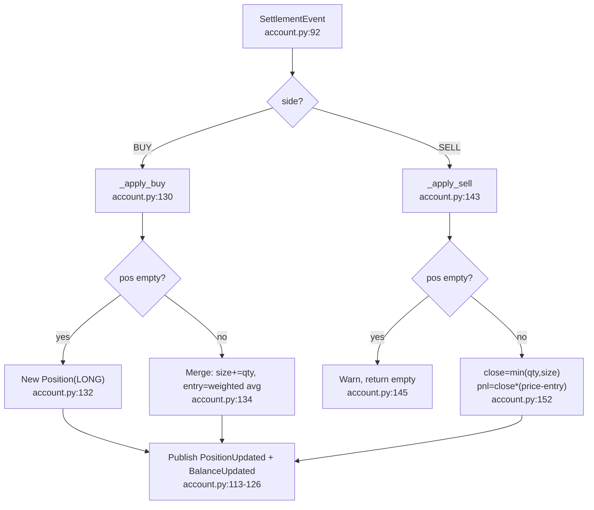

# 01 — Core Domain, Events & Environment (F1+F2+F14)

## Order Lifecycle

> **Gap:** `CANCELLED` (order.py:38) is defined but has no reachable code path.

## Event Causal Chain

All events share the same `correlation_id` via `Event.caused_by()` (event.py:33).

## Position Update Flow

> **Gap:** Position is always `LONG`. Short selling not implemented.

## Event Type Inheritance

```mermaid
flowchart TD
    Event["Event (frozen)<br/>event.py:27"] --> M["Market Events"]
    Event --> S["Signal Events"]
    Event --> P["Portfolio Events"]
    Event --> R["Risk Events"]
    Event --> O["Order Events"]
    Event --> E["Execution Events"]
    Event --> ST["Settlement Events"]
    Event --> A["Account Events"]
    Event --> MO["Monitor Events"]
    M --> TradeEvent["TradeEvent<br/>events.py:32"]
    M --> BookEvent["BookEvent<br/>events.py:41"]
    M --> FundingRateEvent["FundingRateEvent<br/>events.py:59"]
    S --> SignalEvent["SignalEvent<br/>events.py:72"]
    P --> TargetPositionEvent["TargetPositionEvent<br/>events.py:84"]
    R --> RiskApprovedEvent["RiskApprovedEvent<br/>events.py:99"]
    R --> RiskRejectedEvent["RiskRejectedEvent<br/>events.py:105"]
    O --> OrderReadyEvent["OrderReadyEvent<br/>events.py:115 ⚠️UNUSED"]
    O --> OrderSubmittedEvent["OrderSubmittedEvent<br/>events.py:124"]
    E --> FillEvent["FillEvent<br/>events.py:131"]
    E --> OrderFilledEvent["OrderFilledEvent<br/>events.py:147"]
    ST --> SettlementEvent["SettlementEvent<br/>events.py:157"]
    A --> PositionUpdatedEvent["PositionUpdatedEvent<br/>events.py:174"]
    A --> BalanceUpdatedEvent["BalanceUpdatedEvent<br/>events.py:183"]
    MO --> PnLEvent["PnLEvent<br/>events.py:193"]
    MO --> AlertEvent["AlertEvent<br/>events.py:202"]
```

## External Dependencies
Core domain (F1) + Env (F14): **stdlib only** — zero third-party imports.
Events (F2): imports only `core/domain/`.
