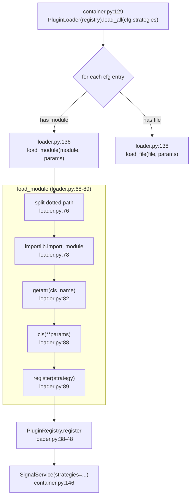
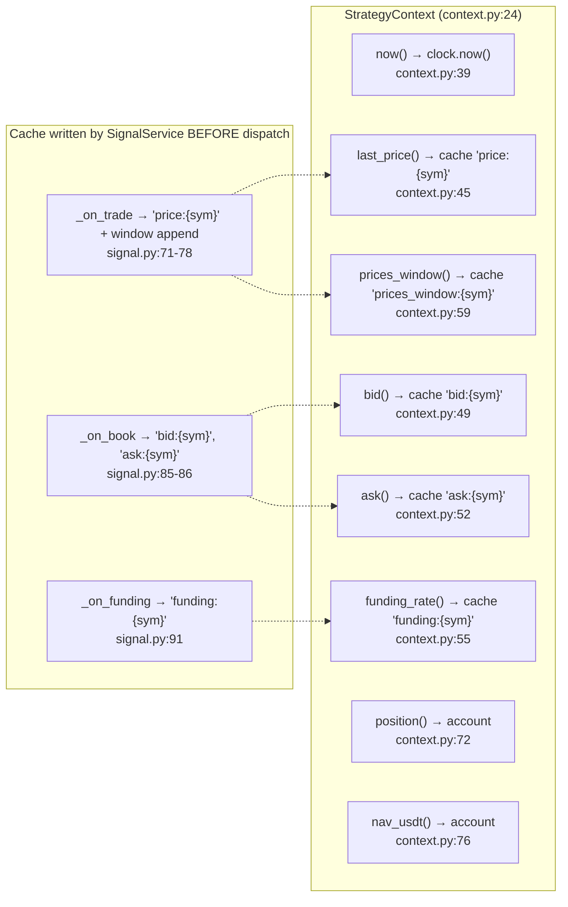

# 02 — Strategy Framework & Implementations (F3+F13)

## Strategy Loading Flow



## StrategyContext Data Access



## Signal Generation Formulas

### MomentumStrategy (momentum.py:116-130)
```
ret = price[-1] / price[0] - 1
score = clamp(ret / 0.05, -1, 1)
confidence = min(1, |ret| / 0.10)
Gate: |score| < 0.15 → no signal
```

### MeanReversionStrategy — Trade channel (mean_reversion.py:126-149)
```
z = (current - mean) / stddev
score = clamp(-z / 2.5, -1, 1)    ← negative: price > mean → short
confidence = min(1, |z| / 3.75)
Gate: |z| < 1.5 → no signal
```

### MeanReversionStrategy — Funding channel (mean_reversion.py:93-111)
```
score = clamp(-rate / 0.003, -1, 1)
confidence = min(1, |rate| / 0.003)
Gate: |rate| < 0.001 → no signal
```

### FundingRateArbStrategy (funding_rate_arb.py:64-103)
```
rate > 0 (longs pay): raw = -(rate - 0.001) / 0.004 → short
rate < 0 (shorts pay): raw = (-rate - 0.001) / 0.004 → long
score = clamp(raw, -1, 1)
confidence = min(1, |rate| / 0.0075)
Gate: |rate| < 0.001 → no signal
Decay: each TradeEvent re-emits with decay = 1 - bar/8
```

## External Dependencies
- Strategy framework (F3): `core/`, `application/events.py` (TYPE_CHECKING)
- Strategy implementations (F13): `core/` only
