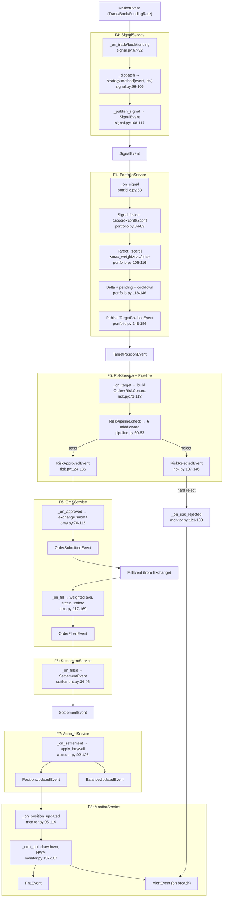
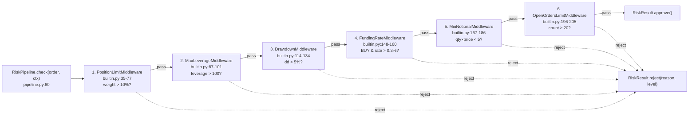

# 03 — Application Services Pipeline (F4-F9)

## MAIN PIPELINE: MarketEvent → PnLEvent



## Risk Pipeline: 6 Middleware (in execution order)



> Note: `reduce_only=True` orders skip middleware 1-4 (only 5+6 apply).

## Signal Fusion Formula

```
combined_score = Σ(score_i × confidence_i) / Σ(confidence_i)

Example:
  momentum:      score=+0.6, conf=0.8 → +0.48
  mean_reversion: score=-0.3, conf=0.5 → -0.15
  combined = (0.48 - 0.15) / (0.8 + 0.5) = +0.254 → small long
```

## Target Position & Delta Formulas

```
target_size = |combined_score| × max_weight × nav / price    (portfolio.py:109)
effective_size = current_size + pending_delta                  (portfolio.py:133)
delta = |target_size - effective_size|                         (portfolio.py:134)
```

## Account NAV

```
nav = USDT_balance + Σ(position.size × mark_price)             (account.py:60-66)
```

## Monitor Key Metrics

```
drawdown = max(0, (HWM - nav) / HWM)                           (monitor.py:146)
Sharpe = mean(returns) / std(returns) × sqrt(8760)              (monitor.py:245)
win_rate = wins / (wins + losses)                               (monitor.py:219)
```
