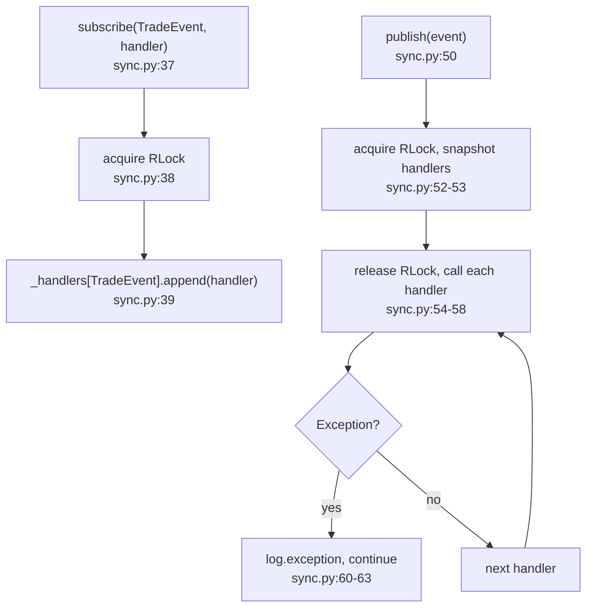
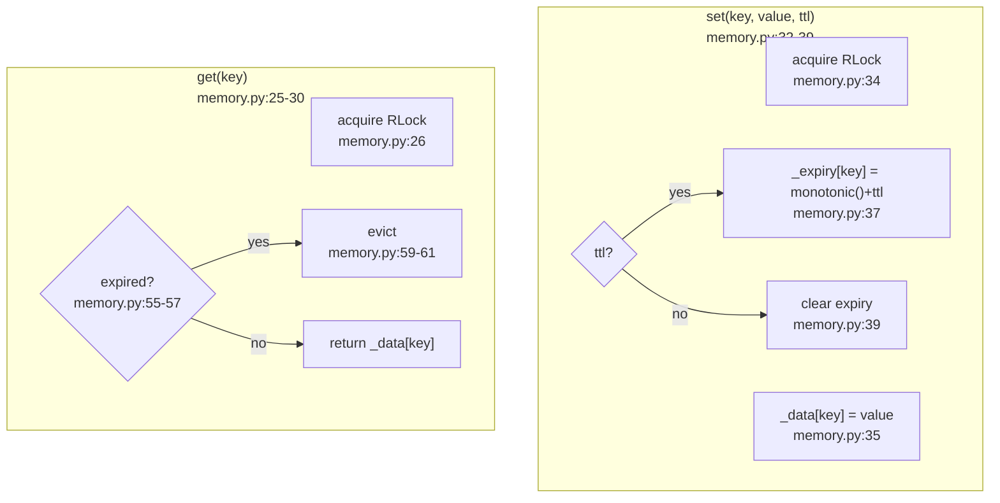
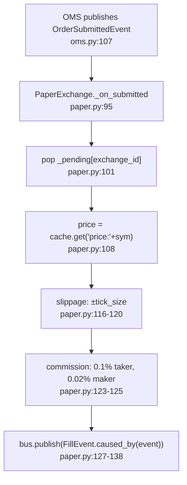
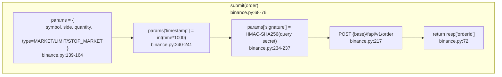
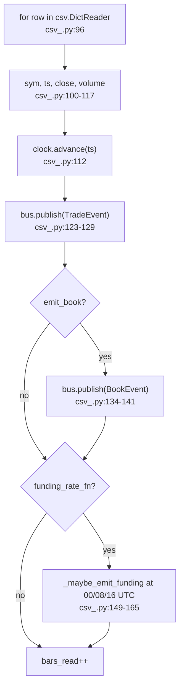
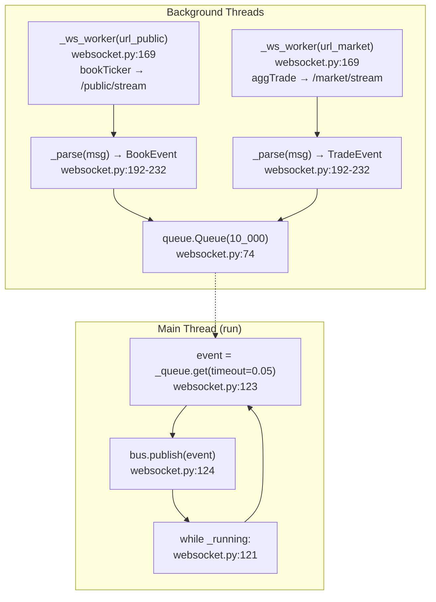
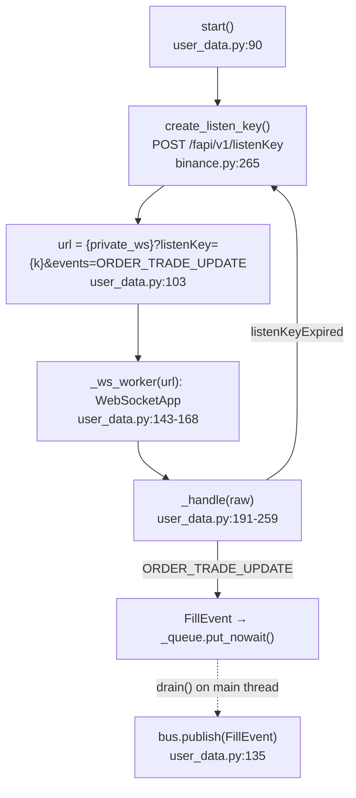

# 04 — Adapters Layer (F10+F11+F12)

## Port-to-Adapter Mapping

| Port (`core/ports/`) | Adapter | File |
|---|---|---|
| `EventBusPort` | `SyncEventBus` | adapters/bus/sync.py:27 |
| `CachePort` | `MemoryCache` | adapters/cache/memory.py:15 |
| `ExecutionPort` | `PaperExchange` | adapters/exchange/paper.py:32 |
| `ExecutionPort` | `BinanceFuturesExchange` | adapters/exchange/binance.py:37 |
| *(none)* | `CsvFeed` | adapters/feed/csv_.py:44 |
| *(none)* | `BinanceWsFeed` | adapters/feed/websocket.py:38 |
| *(none)* | `BinanceUserDataStream` | adapters/feed/user_data.py:52 |

## SyncEventBus

## MemoryCache (TTL support)

## PaperExchange: Simulated Fill

## BinanceFuturesExchange: HMAC Signing

## CsvFeed Row → Event

## BinanceWsFeed: WebSocket → Queue → Bus

## BinanceUserDataStream: listenKey → FillEvent

