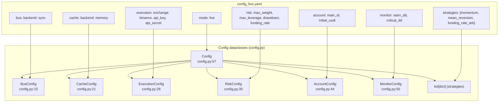
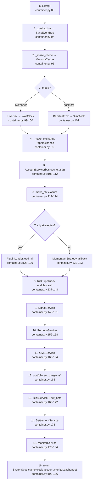
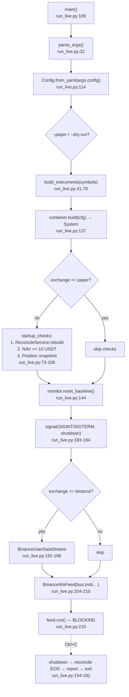
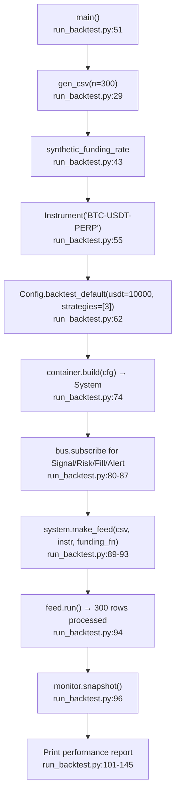

# 05 — Configuration & Entry Points (F15+F16)

## Config Dataclass Hierarchy

## Container build() Assembly Order

## run_live.py Startup Sequence

## run_backtest.py Sequence

## config_live.yaml Key Values vs Defaults

| YAML Path | YAML Value | Python Default |
|-----------|-----------|----------------|
| `mode` | `live` | `backtest` |
| `execution.exchange` | `binance` | `paper` |
| `account.initial_usdt` | `10.0` | `10_000.0` |
| `risk.max_weight` | `0.10` | `0.10` |
| `risk.max_leverage` | `100` | `10` |
| `risk.max_drawdown` | `0.05` | `0.05` |
| `risk.max_funding_rate` | `0.003` | `0.003` |
| `strategies` | 3 strategies | `[]` (empty) |
