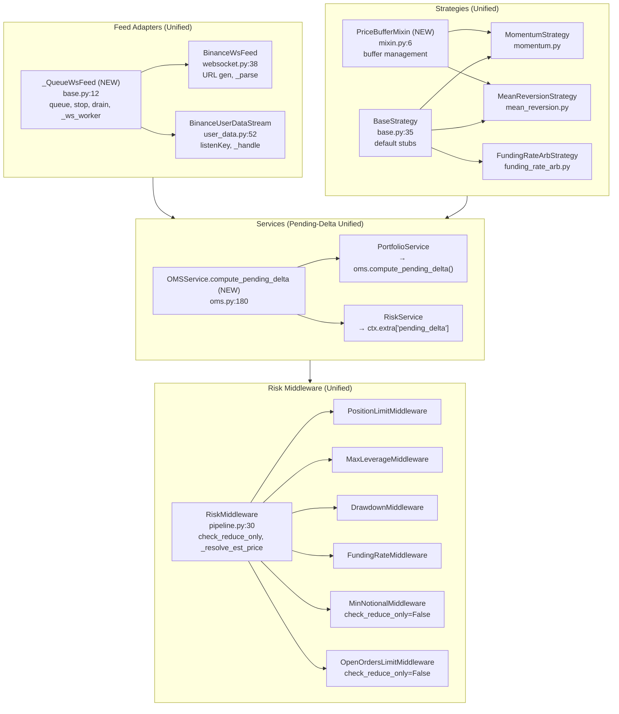

# 03 — Unified Architecture Proposal

## Principles Applied

1. **Simplest unification wins** — prefer deletion over abstraction
2. **Single path per concern** — one place for pending-delta, one for WS skeleton
3. **Preserve legitimate specialization** — keep listenKey lifecycle, keep strategy-specific scoring formulas

---

## Proposal 1: Centralize Pending-Delta Calculation

**Current state:** 3 locations compute pending order delta independently (builtin.py:45, portfolio.py:126, risk.py:98).

**Target:** One utility function in OMSService (the natural owner of open-order state).

**Unified design:**

```python
# application/services/oms.py (new method at line ~180)

def compute_pending_delta(self, symbol: str) -> Decimal:
    """Return net position delta from in-flight orders for symbol.
    BUY orders add, SELL orders subtract.
    """
    delta = Decimal(0)
    for order in self.get_open_orders(symbol):
        if order.side == Side.BUY:
            delta += order.remaining_qty
        else:
            delta -= order.remaining_qty
    return delta
```

**Call site rewrite:**

| Before | After |
|--------|-------|
| `builtin.py:45-52` — inline loop | `delta = oms.compute_pending_delta(sym)` (passed via ctx.open_orders → oms ref) |
| `portfolio.py:126-130` — inline loop | `pending_delta = self._oms.compute_pending_delta(sym)` |
| `risk.py:98-100` — inverted logic | `cur_size -= self._oms.compute_pending_delta(sym)` (flip sign for SELL) |

**Risk:** `PositionLimitMiddleware` receives `ctx.open_orders` (a list) not an `oms` reference. Need to either:
- Pass `oms` via `ctx.extra["oms"]` (minimal change), OR
- Compute pending_delta once in RiskService and pass in `ctx.extra["pending_delta"]`

**Preferred:** Option 2 — compute in RiskService._build_context (risk.py:162), pass precomputed delta. Middleware reads `ctx.extra["pending_delta"]`.

**Impact:** ~18 lines deleted, 1 new method, 3 call sites simplified.

---

## Proposal 2: Shared WebSocket Queue-Feed Base

**Current state:** `BinanceWsFeed` and `BinanceUserDataStream` each have ~40 lines of identical queue/thread/stop/reconnect logic.

**Target:** Shared base class `_QueueWsFeed` in `adapters/feed/base.py`.

**Unified design:**

```python
# adapters/feed/base.py (NEW FILE)

class _QueueWsFeed:
    """Base for queue-based WebSocket feeds with reconnection."""

    def __init__(self, bus: EventBusPort, queue_size: int = 10_000):
        self._bus = bus
        self._queue: queue.Queue = queue.Queue(maxsize=queue_size)
        self._running = False
        self._thread: threading.Thread | None = None

    def stop(self) -> None:
        self._running = False

    def drain(self, timeout: float = 0.05) -> int:
        """Publish all queued events to bus. Returns count."""
        count = 0
        while True:
            try:
                event = self._queue.get(timeout=timeout)
                self._bus.publish(event)
                count += 1
            except queue.Empty:
                break
        return count

    def _ws_worker(self, url: str, parser: Callable[[str], Event | None]) -> None:
        """WebSocket worker template. parser(raw) → Event or None."""
        def on_message(ws, msg):
            try:
                event = parser(msg)
                if event:
                    self._queue.put_nowait(event)
            except queue.Full:
                log.warning("WS queue full, dropping message")
            except Exception:
                log.exception("WS parse error")

        def on_error(ws, err):
            log.error("WS error: %s", err)

        def on_close(ws, code, msg):
            log.warning("WS close: %s %s", code, msg)
            if self._running:
                log.info("Reconnecting...")
                time.sleep(3)
                self._ws_worker(url, parser)

        import websocket
        ws = websocket.WebSocketApp(url, on_message=on_message, on_error=on_error, on_close=on_close)
        ws.run_forever(ping_interval=30, ping_timeout=10)
```

**Subclass changes:**

```python
# adapters/feed/websocket.py (BinanceWsFeed)

class BinanceWsFeed(_QueueWsFeed):
    def __init__(self, bus, instruments, market_type="futures", testnet=False, user_data_stream=None):
        super().__init__(bus, queue_size=10_000)
        self._instruments = {k.lower(): v for k, v in instruments.items()}
        self._uds = user_data_stream
        # URL generation logic stays here

    def _parse(self, raw: str) -> TradeEvent | BookEvent | None:
        # Existing parse logic unchanged

    def start(self):
        urls = self._build_urls()
        for url in urls:
            t = threading.Thread(target=self._ws_worker, args=(url, self._parse), daemon=True)
            t.start()
```

```python
# adapters/feed/user_data.py (BinanceUserDataStream)

class BinanceUserDataStream(_QueueWsFeed):
    def __init__(self, bus, exchange, instruments, testnet=False):
        super().__init__(bus, queue_size=1_000)
        self._exchange = exchange
        self._instruments = {k.lower(): v for k, v in instruments.items()}
        # listenKey lifecycle stays here

    def _handle(self, raw: str) -> FillEvent | None:
        # Existing handle logic unchanged

    def start(self):
        self._listen_key = self._exchange.create_listen_key()
        url = f"{self._ws_base}?listenKey={self._listen_key}&events=ORDER_TRADE_UPDATE"
        # keepalive thread logic stays here
        threading.Thread(target=self._ws_worker, args=(url, self._handle), daemon=True).start()
```

**Impact:** ~40 lines deleted from each subclass (~80 total), 1 new file (~35 lines). Boilerplate eliminated. Specialization preserved (listenKey, URL generation, parsing).

---

## Proposal 3: PriceBufferMixin for Strategies

**Current state:** `MomentumStrategy` and `MeanReversionStrategy` both have identical price-buffer init + append + warm-up guard (~10 lines each).

**Target:** Mixin providing `_prices`, `_ensure_buffer`, `_append_price`, `_is_warmed_up`.

**Unified design:**

```python
# strategies/mixin.py (NEW FILE)

class PriceBufferMixin:
    """Rolling price window for strategies."""

    _prices: dict[str, deque[Decimal]]
    _window: int

    def _init_buffer(self, window: int) -> None:
        self._prices = {}
        self._window = window

    def _ensure_buffer(self, sym: str) -> deque[Decimal]:
        if sym not in self._prices:
            self._prices[sym] = deque(maxlen=self._window)
        return self._prices[sym]

    def _append_price(self, sym: str, price: Decimal) -> None:
        buf = self._ensure_buffer(sym)
        buf.append(price)

    def _is_warmed_up(self, sym: str) -> bool:
        return len(self._ensure_buffer(sym)) >= self._window

    def _prices_list(self, sym: str) -> list[Decimal]:
        return list(self._ensure_buffer(sym))
```

**Subclass changes:**

```python
# strategies/momentum.py

class MomentumStrategy(PriceBufferMixin, Strategy):
    def __init__(self, window=20, scale=0.05, min_score=0.20):
        self._init_buffer(window)
        self._scale = scale
        self._min_score = min_score
        self.name = "momentum"
        self.version = "1.0.0"

    def on_trade(self, event, ctx):
        sym = event.instrument.symbol
        self._append_price(sym, event.price)
        if not self._is_warmed_up(sym):
            return []
        prices = self._prices_list(sym)
        # ... rest of scoring unchanged
```

**Impact:** ~20 lines deleted from each strategy (~40 total), 1 new file (~20 lines). Warm-up guard and buffer management unified.

---

## Proposal 4: Resolve Market-Price Estimation

**Current state:** `PositionLimitMiddleware` and `MinNotionalMiddleware` have identical ~10-line block to resolve estimated price.

**Target:** Static helper on `RiskMiddleware` base class.

**Unified design:**

```python
# application/risk/pipeline.py (extend RiskMiddleware)

class RiskMiddleware:
    @staticmethod
    def _resolve_est_price(order: Order, ctx: RiskContext) -> Decimal | None:
        """Resolve estimated execution price from order or cache. Returns None if unavailable."""
        est_price = order.limit_price
        if est_price is not None and est_price > 0:
            return est_price
        cache_price = ctx.extra.get("price")
        if cache_price is not None and cache_price > 0:
            return cache_price
        return None
```

**Call site rewrite:**

```python
# builtin.py:59-69 → becomes:

est_price = self._resolve_est_price(order, ctx)
if est_price is None:
    return RiskResult.reject("无法确定预估价格", level="hard")
# ... proceed with est_price

# builtin.py:170-177 → becomes:

est_price = self._resolve_est_price(order, ctx)
if est_price is None:
    return call_next(order, ctx)  # lenient skip
# ... proceed with est_price
```

**Impact:** ~18 lines deleted, 1 new static method (~8 lines). Branching logic stays in caller (legitimate divergence preserved).

---

## Proposal 5: Standardize `reduce_only` Guard

**Current state:** 4 middleware classes have guard, 2 classes lack it (inconsistent behavior).

**Target:** Class attribute on base `RiskMiddleware` controlling default behavior.

**Unified design:**

```python
# application/risk/pipeline.py (extend RiskMiddleware)

class RiskMiddleware:
    check_reduce_only: bool = True  # default: skip for reduce-only orders

    def process(self, order: Order, ctx: RiskContext, call_next: Next) -> RiskResult:
        if self.check_reduce_only and order.reduce_only:
            return call_next(order, ctx)
        return self._do_check(order, ctx, call_next)  # subclass implements this

    def _do_check(self, order: Order, ctx: RiskContext, call_next: Next) -> RiskResult:
        raise NotImplementedError
```

**Subclass changes:**

```python
# builtin.py — each middleware now only needs to implement _do_check

class MinNotionalMiddleware(RiskMiddleware):
    check_reduce_only = False  # override: apply even for reduce-only (min_notional should still pass)

    def _do_check(self, order, ctx, call_next):
        est_price = self._resolve_est_price(order, ctx)
        if est_price is None:
            return call_next(order, ctx)
        # ... min_notional check
```

**Impact:** ~8 lines deleted (guard code), consistent behavior across all middleware. New pattern: `_do_check` replaces `process` override.

---

## Proposal 6: BaseStrategy with Default Stubs

**Current state:** 3 strategies each define ~24 lines of identical no-op protocol methods.

**Target:** `BaseStrategy` class with default implementations.

**Unified design:**

```python
# application/strategy/base.py (extend)

class BaseStrategy(Strategy):
    """Strategy with default no-op stubs for optional methods."""

    def on_book(self, event: BookEvent, ctx: StrategyContext) -> list[Signal]:
        return []

    def on_fill(self, event: FillEvent, ctx: StrategyContext) -> None:
        pass

    def on_start(self) -> None:
        log.info("%s v%s 启动", self.name, self.version)

    def on_stop(self) -> None:
        log.info("%s v%s 停止", self.name, self.version)
```

**Subclass changes:**

```python
# strategies/momentum.py — now inherits from BaseStrategy

class MomentumStrategy(BaseStrategy):
    # on_book/on_fill/on_start/on_stop — DELETE (use defaults)
    # on_trade — keep existing implementation
```

**Impact:** ~72 lines deleted (24 per strategy). Strategies now only define methods they actually use.

---

## Summary: Lines Deleted vs Added

| Proposal | Deleted | Added | Net |
|----------|---------|-------|-----|
| 1. Pending-delta | 18 | 8 | -10 |
| 2. WS Queue Base | 80 | 35 | -45 |
| 3. PriceBufferMixin | 40 | 20 | -20 |
| 4. Est-price helper | 18 | 8 | -10 |
| 5. reduce_only guard | 8 | 5 | -3 |
| 6. BaseStrategy stubs | 72 | 8 | -64 |
| **TOTAL** | **236** | **84** | **-152** |

---

## Unified System Flowchart (Post-Refactor)



---

## Loss of Capability Assessment

| Change | Potential Loss | Mitigation |
|--------|----------------|------------|
| WS base class | Subclass flexibility (ping interval, queue size) | Pass as constructor kwargs |
| PriceBufferMixin | Per-strategy buffer customization | Keep `_window` configurable in mixin init |
| Pending-delta centralization | Middleware cannot compute independently | Pass precomputed delta in `ctx.extra` |
| reduce_only guard standardization | Some middleware might need custom logic | Override `check_reduce_only` per class |

All losses are acceptable — flexibility preserved via kwargs/overrides.

---

## Next Steps

For each proposal, see handoff prompts in `04-handoff-prompts.md`.